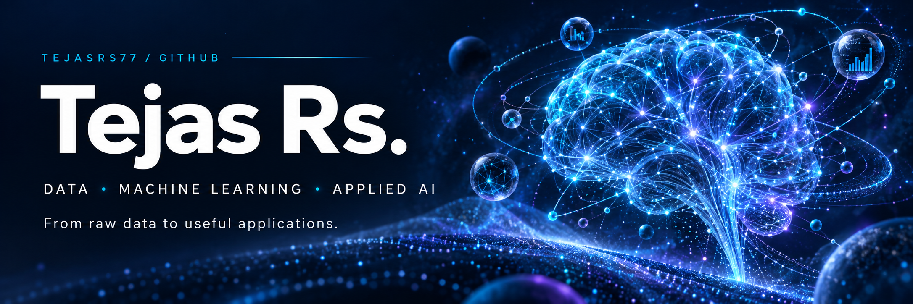

<h1>Hey there, I'm Tejas Rs 👋</h1>

  
  
  

 

<h2>About Me</h2>

<table width="100%">
  <tr>
    <td width="65%" align="center" valign="middle">
      <h3>From raw data to useful applications.</h3>
      
I'm <b>Tejas Rs</b>, here on GitHub as <b>@tejasrs77</b>.

      
I build projects exploring <b>data engineering</b>, <b>machine learning</b>, and <b>applied AI</b>.

      
My work spans healthcare record retrieval with RAG, aircraft-engine predictive maintenance, financial reconciliation, and transaction data pipelines.

      
I enjoy connecting data, models, and interfaces to turn ideas into working applications.

    </td>
    <td width="35%" align="center" valign="middle">
      
      
<b>TEJAS RS</b> DATA · ML · APPLIED AI

    </td>
  </tr>
</table>

 

<h2>🚀 Featured Projects</h2>

### 🏥 EHR Insight and Clinical Validator

An educational healthcare RAG application for exploring a selected patient's historical records through a conversational interface.

- Patient-scoped semantic retrieval using clinical embeddings.
- PII redaction with Microsoft Presidio.
- Response controls using NVIDIA NeMo Guardrails.
- Streamlit interface with FastAPI and PostgreSQL vector search.

**Built with:** Python · FastAPI · Streamlit · PostgreSQL · pgvector · Docker · AWS

[Explore EHR Insight →](https://github.com/tejasrs77/EHR-Insight-and-clinical-validator)

---

### ✈️ AeroGuard AI

Predictive maintenance and a grounded reliability copilot using NASA C-MAPSS turbofan data. Explores machine learning for aircraft-engine maintenance and reliability.

[Explore AeroGuard AI →](https://github.com/tejasrs77/aeroguard-ai)

---

### 💰 FinRecon AI

AI-powered financial reconciliation, anomaly detection, and revenue leakage analysis with a control-tower dashboard for exploring financial discrepancies.

[Explore FinRecon AI →](https://github.com/tejasrs77/finrecon-ai)

---

### 🔄 Finance ETL

A data engineering project focused on financial transaction pipelines, exploring the journey from raw financial data to structured information for analysis.

[Explore Finance ETL →](https://github.com/tejasrs77/finance-etl)

---

<h2 align="center">🛠️ Tech Stack</h2>

<table width="100%">

  <tr>
    <th align="left" width="25%">Property</th>
    <th align="left">Technologies</th>
  </tr>

  <tr>
    <td><b>Languages</b></td>
    <td align="left">
      
      
      
      
      
    </td>
  </tr>

  <tr>
    <td><b>Areas of Interest</b></td>
    <td align="left">
      
      
      
      
    </td>
  </tr>

  <tr>
    <td><b>Databases</b></td>
    <td align="left">
      
      
      
      
    </td>
  </tr>

  <tr>
    <td><b>Machine Learning</b></td>
    <td align="left">
      
      
      
      
      
    </td>
  </tr>

  <tr>
    <td><b>Data Analysis</b></td>
    <td align="left">
      
      
      
    </td>
  </tr>

  <tr>
    <td><b>AI Retrieval & Guardrails</b></td>
    <td align="left">
      
      
      
    </td>
  </tr>

  <tr>
    <td><b>Cloud & Development Tools</b></td>
    <td align="left">
      
      
      
      
      
    </td>
  </tr>

</table>

 

<h2>📊 GitHub Activity</h2>

  

 

<h2>🐍 One Contribution at a Time</h2>

<picture>
  <source
    media="(prefers-color-scheme: dark)"
    srcset="https://raw.githubusercontent.com/tejasrs77/tejasrs77/output/github-snake-dark.svg">
  <source
    media="(prefers-color-scheme: light)"
    srcset="https://raw.githubusercontent.com/tejasrs77/tejasrs77/output/github-snake.svg">
  
</picture>

  

<h2>🤝 Let's Connect</h2>

  

  

  

 

  Thanks for stopping by. Explore my projects and follow along as I build.

