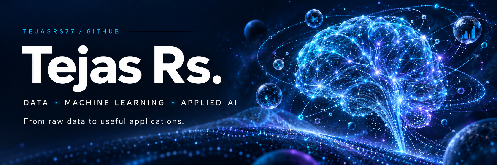

### Building applications with data, machine learning, and applied AI.

  
  

## About me

I'm Tejas, an Artificial Intelligence & Machine Learning engineering student interested in building practical AI systems that connect **data, machine learning models, backend services, and application interfaces**.

My work explores healthcare record retrieval, predictive maintenance, financial reconciliation, and large-scale transaction processing.

🎯 **Currently focused on:** Applied AI · Machine Learning · RAG Systems · Data Engineering

I enjoy taking projects beyond model training — from preparing and storing data to building APIs, interfaces, evaluation pipelines, and deployable applications.

---

## Featured projects

### 🏥 EHR Insight & Clinical Validator

An educational healthcare RAG application for exploring a selected patient's historical health records through a conversational interface.

- **RAG pipeline:** Patient-scoped semantic retrieval using clinical embeddings and PostgreSQL vector search.
- **Privacy:** PII detection and redaction using Microsoft Presidio.
- **AI safety:** Response controls and conversational guardrails using NVIDIA NeMo Guardrails.
- **Architecture:** Streamlit frontend backed by FastAPI and PostgreSQL/pgvector.
- **Deployment stack:** Docker and AWS.
- **Stack:** Python · FastAPI · Streamlit · PostgreSQL · pgvector · Presidio · NeMo Guardrails · Docker · AWS

[View repository →](https://github.com/tejasrs77/EHR-Insight-and-clinical-validator)

---

### ✈️ AeroGuard AI

An AI-powered predictive maintenance project exploring aircraft-engine reliability using the NASA C-MAPSS turbofan engine dataset.

- **Objective:** Analyze engine degradation patterns and estimate remaining useful life for predictive maintenance.
- **Machine learning:** Uses historical sensor and operational data to model aircraft-engine health.
- **Reliability AI:** Combines predictive analytics with a grounded AI copilot for interpreting maintenance information.
- **Data:** NASA C-MAPSS turbofan degradation dataset.
- **Focus:** Predictive Maintenance · Machine Learning · Remaining Useful Life · Reliability Analytics

[View repository →](https://github.com/tejasrs77/aeroguard-ai)

---

### 💳 FinRecon AI

An intelligent financial reconciliation platform for matching financial records, identifying discrepancies, and investigating potential revenue leakage.

- **Reconciliation:** Matches payments, settlements, refunds, and bank transactions across multiple financial sources.
- **Anomaly detection:** Identifies missing settlements, duplicate credits, incorrect references, fee mismatches, GST mismatches, and other financial anomalies.
- **AI investigation:** Provides evidence-based root-cause analysis and recommended actions for reconciliation exceptions.
- **Evaluation:** Tested using **5,000+ deterministic synthetic financial records** with controlled anomalies and hidden ground truth.
- **Interface:** Control-tower dashboard for investigating reconciliation results and financial exceptions.
- **Focus:** Financial Reconciliation · Anomaly Detection · Applied AI · Financial Analytics

[View repository →](https://github.com/tejasrs77/finrecon-ai)

---

### 📊 Finance ETL

A production-style financial data engineering pipeline that transforms raw transaction data into structured analytical datasets.

- **Scale:** Processes approximately **200K synthetic financial transactions**.
- **ETL:** Python/Pandas ingestion, validation, transformation, and loading pipeline.
- **Warehouse design:** MySQL star schema with **SCD Type 2** customer history.
- **Reliability:** Incremental loading with watermarks, upserts, checksums, batch inserts, and transactional rollback.
- **Analytics:** Analytical indexes and SQL queries for transaction analysis.
- **Testing:** Automated pipeline validation with **49 pytest tests**.
- **Stack:** Python · Pandas · MySQL · SQLAlchemy · Pytest · FastAPI · React

[View repository →](https://github.com/tejasrs77/finance-etl)

---

<h2>🛠️ My developer toolkit</h2>

<i>From raw data to intelligent, deployable applications.</i>

<h3>🐍 Code & explore</h3>

Languages and tools for working with data

  
  
  
  
  

<h3>🧠 Train & understand</h3>

Machine learning, evaluation, and interpretation

  
  
  
  
  

<h3>🔎 Retrieve & reason</h3>

Retrieval systems, vector search, and responsible AI

  
  
  
  

<h3>🗄️ Store & process</h3>

Databases, vector storage, and data pipelines

  
  
  
  
  

<h3>⚡ Build & interact</h3>

APIs and application interfaces

  
  
  

<h3>🚀 Test & ship</h3>

Version control, testing, automation, and deployment

  
  
  
  
  

---

<h2>🔥 GitHub Streak</h2>

<i>Consistency compounds — one commit at a time.</i>

 

---

<h2>🐍 Contribution Journey</h2>

<i>Building consistently, one contribution at a time.</i>

 

<picture>
  <source
    media="(prefers-color-scheme: dark)"
    srcset="https://raw.githubusercontent.com/tejasrs77/tejasrs77/output/github-snake-dark.svg"
  >
  <source
    media="(prefers-color-scheme: light)"
    srcset="https://raw.githubusercontent.com/tejasrs77/tejasrs77/output/github-snake.svg"
  >
  
</picture>

---

### Let's build something useful.

I'm interested in opportunities involving **Artificial Intelligence, Machine Learning, Applied AI, and Data Engineering**.

 

  
  

